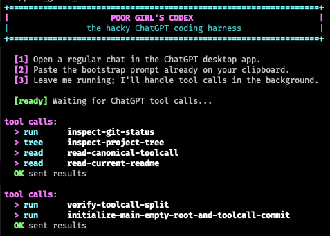
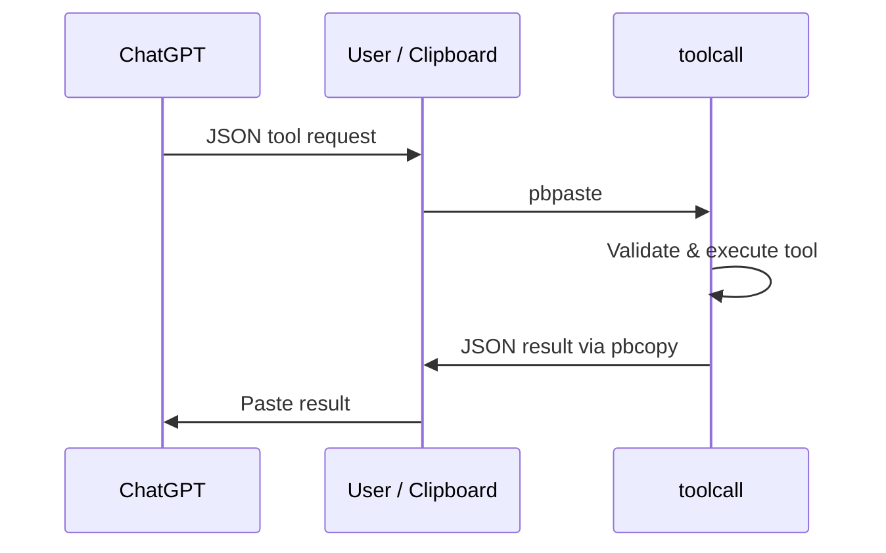

# Poor Girl's Codex

Poor Girl's Codex is a tiny, deliberately transparent coding-agent harness for the ChatGPT desktop app on macOS.



It started as a joke and a workaround: if a coding model in an ordinary ChatGPT conversation can *describe* a tool call, why should it need a special agent product to actually execute one?

The first version was almost comically simple. ChatGPT emitted JSON, the user copied it, and a local program named `toolcall` executed the request:



The command at the center of that loop was:

```sh
pbpaste | toolcall | pbcopy
```

The user was the transport layer.

That worked surprisingly well. More importantly, it made the mechanics of an AI coding agent impossible to miss: the model writes structured data, ordinary software validates and executes it, the result is serialized, and the model gets another turn.

From there, Poor Girl's Codex gradually removed the human copy/paste steps until the same basic protocol could run continuously in the background.

## The evolution

The Git history intentionally preserves the project in stages.

1. **`Initial commit`** — an empty root commit.
2. **`Add clipboard toolcall harness`** — the original standalone `~/bin/toolcall`, unchanged.
3. **`Add autonomous ChatGPT desktop harness`** — the current Accessibility-driven system.
4. **This README** — documentation of how and why the experiment evolved.

The standalone `toolcall` program became `toolcall_lib.py`, while `toolcall` itself became a thin command-line wrapper around the same implementation. This means the original clipboard workflow and the autonomous workflow share the exact same tool execution code.

The autonomous layer then grew experimentally around the macOS Accessibility APIs exposed by PyObjC.

Early experiments inspected the ChatGPT desktop application's Accessibility tree and discovered that Chromium exposes enough structure to identify:

- the message composer,
- the Send button,
- user and assistant message boundaries,
- assistant code blocks,
- and the text nodes inside syntax-highlighted code.

That led to the current design: instead of clicking Copy buttons or reading the clipboard, Poor Girl's Codex walks the Accessibility tree directly, reconstructs candidate JSON from `AXStaticText` nodes, validates it as a supported tool request, executes it locally, and writes the result back into the ChatGPT composer.

Submission is also kept scoped to ChatGPT. The harness focuses the composer through Accessibility and posts a Return event directly to the ChatGPT process rather than globally stealing the user's mouse or keyboard.

The clipboard remains involved only once at startup, as a convenience: the bootstrap prompt is copied so the user can paste it into an ordinary ChatGPT conversation. Normal tool execution after that does not depend on the clipboard.

## What it does

Run:

```sh
./poor_girls_codex
```

The default `watch` mode:

1. copies a bootstrap prompt to the clipboard,
2. watches the current ChatGPT conversation through macOS Accessibility,
3. detects the newest valid Poor Girl's Codex JSON tool request,
4. waits briefly to avoid executing a partially streamed response,
5. executes the request in-process using `toolcall_lib`,
6. places the JSON result into the ChatGPT composer,
7. submits it back to ChatGPT,
8. and repeats.

The model can therefore perform a normal coding-agent loop:

```text
inspect -> reason -> edit -> test -> inspect -> reason -> ...
```

without a purpose-built agent runtime.

The harness currently exposes these tools:

| Tool | Purpose |
| --- | --- |
| `read` | Read UTF-8 files with line ranges and SHA-256 metadata |
| `find` | Search files with ripgrep |
| `tree` | Inspect directory structure |
| `status` | Read Git status |
| `diff` | Read Git diffs |
| `edit` | Perform exact, optionally SHA-guarded textual edits |
| `write` | Create or replace files |
| `patch` | Apply unified diffs with `git apply --check` first |
| `run` | Execute commands or Bash scripts with captured output |

Requests may be single calls, arrays of calls, or batches of the form:

```json
{
  "calls": [
    {
      "id": "inspect",
      "tool": "read",
      "path": "src/example.py",
      "start": 1,
      "end": 100
    },
    {
      "id": "tests",
      "tool": "run",
      "command": ["pytest", "-q"]
    }
  ],
  "stop_on_error": true
}
```

Every result carries the original call ID, tool name, success state, and tool-specific output.

## Why this is interesting

Poor Girl's Codex is useful partly because it is *not* sophisticated.

Modern AI-agent systems can look mysterious because their tool layer is hidden behind product APIs, orchestration frameworks, proprietary runtimes, or elaborate SDKs. That can create the impression that "agentic AI" requires some fundamentally different kind of model.

This project makes the opposite point in a few hundred lines of ordinary Python.

At the core, function calling is just a protocol:

```text
model emits structured request
        |
        v
host validates request
        |
        v
host performs side effect
        |
        v
host serializes result
        |
        v
model observes result
```

The model never directly reads a file, launches a process, edits source code, or talks to Git. It asks the host to do those things by producing data in an agreed-upon format.

Likewise, there is no magical boundary between a "chatbot" and a "coding agent." Give a conversational model:

- a sufficiently precise tool protocol,
- a loop that feeds tool results back into the conversation,
- and permission to continue until a task is complete,

and you have most of the conceptual machinery of an agent.

Poor Girl's Codex is therefore an intentionally inspectable example of concepts that are often buried inside larger systems:

- **tool schemas** — the contract between model and host,
- **function calling** — structured model output interpreted as a request,
- **tool dispatch** — mapping a tool name to ordinary code,
- **observation** — serializing execution results back to the model,
- **agent loops** — repeatedly alternating reasoning and external action,
- **idempotence and replay concerns** — avoiding accidental re-execution of the same call,
- **streaming hazards** — ensuring partially generated JSON is not executed early,
- **capability boundaries** — the model can only do what the host exposes,
- **stale-write protection** — SHA-guarded edits make concurrent mutation visible,
- **human-in-the-loop transport** — the original clipboard version demonstrates that automation is convenience, not a conceptual requirement.

You can read essentially the entire agent runtime yourself.

That is the educational value of the project.

## Architecture

There are three main pieces.

### `toolcall_lib.py`

The actual local tool implementation.

It parses requests, validates arguments, dispatches tools, captures results, bounds output sizes, and turns failures into structured JSON responses.

This file is also preserved almost verbatim as the second commit in the repository's history, where it originally existed as the standalone `toolcall` program.

### `poor_girls_codex.py`

The autonomous bridge to ChatGPT desktop.

It:

- discovers the running ChatGPT application,
- walks the Accessibility tree,
- locates the conversation and most recent assistant response,
- reconstructs JSON code from Accessibility text nodes,
- validates requests before considering them executable,
- fingerprints calls so they are not repeatedly executed,
- waits for streamed output to settle,
- invokes `toolcall_lib` directly,
- injects results into the composer,
- and submits them with a PID-targeted Return event.

### `probe_chatgpt.py`

A diagnostic tool used while reverse-engineering the ChatGPT desktop Accessibility tree.

It can dump Accessibility attributes, actions, candidate selectors, window information, and the tree itself. It remains in the repository because the desktop application's exposed structure may change, and because the probe documents how the bridge was discovered.

## Debug modes

`poor_girls_codex.py` also retains several smaller modes used while developing and diagnosing the bridge:

```text
watch    continuous autonomous loop; the default
copy     print the newest detected toolcall JSON
execute  execute a detected request and print its result
paste    put a result into the composer without submitting
once     execute, insert, and submit one request
```

A `--source-file` option can provide toolcall JSON directly instead of reading the current conversation.

## Requirements

Poor Girl's Codex currently targets macOS and the ChatGPT desktop application.

The project uses Python 3.14 and PyObjC bindings for:

- Cocoa,
- Quartz,
- ApplicationServices.

Install dependencies with the project's normal `uv` workflow, then grant Accessibility permission to the terminal application from which Poor Girl's Codex is launched:

```text
System Settings
  -> Privacy & Security
  -> Accessibility
```

The ChatGPT desktop application must be running with an ordinary conversation open.

## Design principles

A few constraints emerged during development and became part of the character of the project:

**Keep the protocol visible.** Tool requests and results are plain JSON. There is no opaque RPC layer required to understand what is happening.

**Prefer constrained operations.** Reading, exact editing, diffing, and searching are first-class operations; arbitrary shell execution exists, but the model does not have to reach for it for everything.

**Fail visibly.** Tool failures are serialized back to the model rather than silently disappearing.

**Avoid stale edits.** Tools can require an expected SHA-256 before modifying a file.

**Do not hijack the machine.** Normal autonomous operation avoids moving the mouse, activating ChatGPT, or taking over the global keyboard stream.

**Do not make the clipboard the runtime.** The clipboard-based version was useful as the bootstrap experiment. The current watcher reads assistant output directly from Accessibility and only uses the clipboard for the initial prompt convenience.

**Stay hackable.** This is intentionally a small program, not an agent framework. A curious reader should be able to trace an entire tool request from generated JSON to local side effect and back again.

## A note on the name

The name came from the project's origin as a low-budget, slightly ridiculous substitute for a dedicated coding-agent interface: if the useful part of Codex is ultimately a model exchanging structured tool calls with a host program, perhaps we can build the poor girl's version ourselves.

It turns out we can.

And because the result exposes the machinery so directly, the cheap workaround became a useful teaching tool in its own right.
